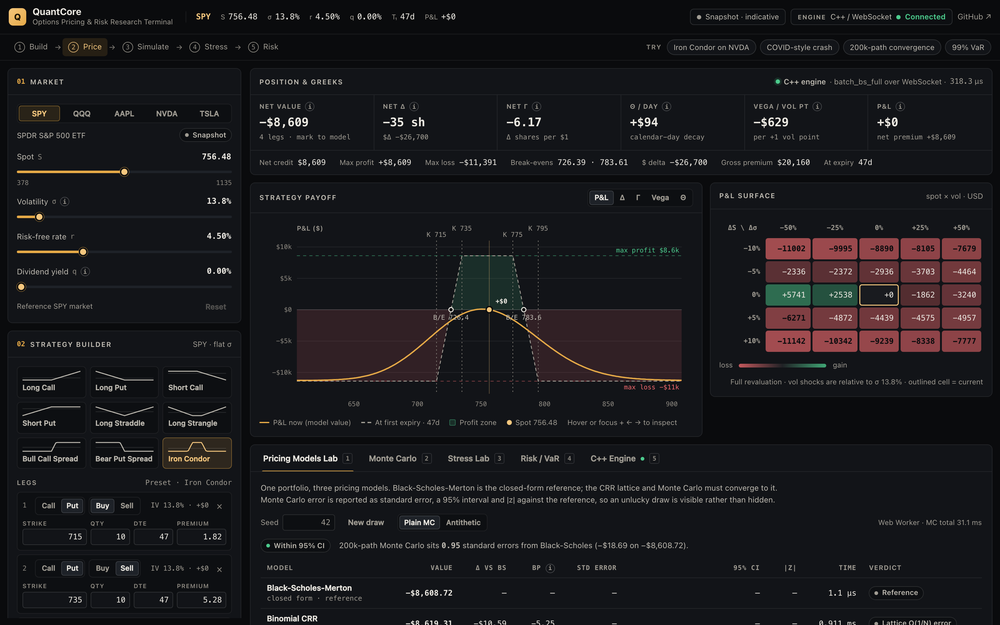

# QuantCore

### ▶ [**Live terminal**](https://quantcore-gk.netlify.app) &nbsp;·&nbsp; [Portfolio](https://gaurangkhurana.ca)

An options pricing and risk research terminal on top of a C++17 pricing engine. Build a strategy, price it three
ways, simulate it, stress it and measure its risk — in the browser, or against the native C++ / Apple Metal engine
over WebSocket when it runs locally.

**Build → Price → Simulate → Stress → Risk**



| | What it does |
|---|---|
| **Strategy Builder** | SPY, QQQ, AAPL, NVDA, TSLA, or any ticker — type a symbol and its price (with the optional data proxy running, any US ticker loads with a live quote, listed expirations and chain strikes). Spot, volatility, rate and dividend-yield inputs, and an arbitrage-free SSVI volatility surface: a smile by strike (flat, equity index, single stock, or custom skew and curvature) and an at-the-money term structure by expiry (flat, upward, inverted or custom) — with live data, fitted to a spread of listed expiries in one step. Nine presets (long/short call and put, straddle, strangle, bull call spread, bear put spread, iron condor) or up to eight custom legs with call/put, buy/sell, strike, quantity, expiry and entry premium — each leg shows the implied volatility of its entry premium. |
| **Greeks & payoff** | Price, Δ, Γ, Θ, ν and P&L tiles; exact max profit / max loss and break-evens; an interactive payoff chart with P&L · Δ · Γ · Vega · Θ modes (hover or keyboard crosshair); a full-revaluation spot × vol P&L surface. |
| **Pricing Models Lab** | The same portfolio priced with Black-Scholes-Merton, a 512-step Cox-Ross-Rubinstein lattice and seeded Monte Carlo at 10k / 50k / 200k paths — difference vs Black-Scholes, standard error, 95% interval, \|z\| and timing, with a convergence chart, the lattice's odd/even error curve, a per-leg breakdown and the American early-exercise premium from the same lattice — and, by finite differences in C++, each leg's American value under the volatility surface's local volatility against its implied volatility, with the early-exercise boundary and a Longstaff–Schwartz Monte Carlo check of it. A C++ cross-check simulates the whole portfolio — on the native engine when it is running, otherwise in WebAssembly — and, with a smile or term structure, a local-volatility Monte Carlo reprices it under Dupire's diffusion. |
| **Monte Carlo** | Animated risk-neutral paths — GBM in a flat market, Dupire local volatility when a smile or term structure is on — with spot, strike, expiry and in-the-money markers; a 50,000-sample terminal distribution against its analytic lognormal or smile-implied density; simulated P(ITM) vs the analytic value; local against implied volatility across strikes. |
| **Exotics** | Barrier options (down- and up-and-out, knock-in by parity), monitored continuously or on a monthly, weekly or daily schedule and optionally paying a rebate at the hit or at expiry, and arithmetic and geometric Asian options on the terminal's market. Reiner–Rubinstein and geometric-average closed forms under flat volatility, with the Broadie–Glasserman–Kou correction when the barrier is monitored on a schedule and Reiner–Rubinstein's E and F terms when it pays a rebate — the two corrections do not compose, and the panel says so rather than showing a reference it cannot compute; the C++ Monte Carlo kernel — Brownian-bridge monitoring, or an indicator on those same dates, up to 16 barrier levels on the same paths — under that volatility as a check, and under the surface's Dupire local volatility, with the vanilla on the same paths as a repricing check, and barriers also solved as a PDE (a second method, with its Greeks). A knock-out-vs-barrier chart, the geometric control variate for arithmetic averages and fine-grid bias estimates; on the native engine or in WebAssembly. |
| **Stress Lab** | 2008-style credit crisis, COVID-style crash, volatility spike, rate shock, melt-up / vol crush, or a custom shock. Shows Spot → Vol → Greeks → P&L → VaR, P&L by leg, a P&L-vs-spot ladder and all scenarios side by side; apply a shock to the whole terminal and reset. |
| **Risk / VaR** | 1-day 95% parametric VaR, plus delta-normal, delta-gamma and Monte Carlo full-revaluation VaR — spot only, and spot with correlated implied-vol shocks — with expected shortfall at 90 / 95 / 99% over 1 / 5 / 10 days, exposures and stated assumptions. |
| **Portfolio Upload** | CSV, XLSX or XLS, parsed entirely in the browser. Tolerant column names (`option_type`, `cp`, `action`, `strike_price`, `dte`, `expiration`, `contracts`, `fill_price`, …), ISO / US / Excel dates, accounting negatives, a row-by-row preview with errors and warnings, and downloadable samples. |
| **C++ Engine** | The C++ core compiled to WebAssembly runs in every browser: build facts, agreement with the TypeScript models and Monte Carlo in a worker. The native engine adds live status, measured round-trip latency, engine-vs-browser agreement and 100k–10M-path Monte Carlo on Metal. Every tile says which engine produced the number and why. |

**How the hosted demo computes.** The public site has no server, so it runs the C++ pricing core itself:
`core/src/black_scholes.cpp`, `monte_carlo.cpp`, `monte_carlo_portfolio.cpp`, `local_vol.cpp`, `exotics.cpp`, `pde.cpp` and `lsm.cpp` compiled with Emscripten into an 84 KB WebAssembly module. The
Greeks tiles are priced by it (labelled *C++ · WebAssembly*), and its Monte Carlo and finite-difference solves run in a Web Worker. Charts,
stress, VaR and the Pricing Lab use TypeScript implementations of the same models, which the unit tests hold to
1e-12 of the C++ results. Run the native engine locally and its badge turns *Connected*: the tiles are then priced
by the native C++ build — the default SPY contract as a stream, any other portfolio as one batch call — and the C++
Engine tab can run the Metal Monte Carlo kernel. Snapshot prices are indicative, not live quotes; a ticker you add is priced from the price you
enter and is labelled *Manual price*.

## Architecture

```
┌───────────────────────── Browser (Next.js 15, static export) ─────────────────────────┐
│  Terminal UI ── lib/quant  BSM · CRR · Monte Carlo       lib/risk  VaR · stress · surface │
│             ── lib/strategy presets · payoff analytics  lib/io    CSV / XLSX import     │
│             ── workers/compute.worker.ts (lab, MC paths, MC VaR — off the main thread)  │
│             ── public/wasm/quantcore.wasm C++ core → WebAssembly (pricing, MC, exotics) │
└──────────────────────────────────────────┬─────────────────────────────────────────────┘
                                           │ WebSocket JSON (localhost only)
                        ┌──────────────────┴──────────────────┐
                        │  FastAPI + uvicorn  server/ws_server │
                        └──────────────────┬──────────────────┘
                                           │ pybind11 (GIL released around C++ compute)
        ┌──────────────────────────────────┴───────────────────────────────────┐
        │                     C++17 pricing core (core/)                        │
        │   Black-Scholes · analytic Greeks · batch pricing · Monte Carlo (GBM) │
        ├───────────────────────────────────┬───────────────────────────────────┤
        │  CPU: Accelerate vForce SIMD      │  GPU: Apple Metal, Philox 4x32-10 │
        │  + multithreaded Monte Carlo      │  counter-based PRNG                │
        └───────────────────────────────────┴───────────────────────────────────┘
```

The WebAssembly module is built by `scripts/build-wasm.sh` from the same C++ sources plus
`bindings/quantcore_wasm.cpp` — standalone, with no imports and no JavaScript glue. The build is reproducible: a
manifest records the Emscripten version, flags and SHA-256 of the module and every source; the unit tests fail if a
source changes without a rebuild, and CI rebuilds it and requires a byte-identical result.

The Python layer (`python/`) holds the benchmark harnesses, market-data validation and the VaR backtest. An optional
Go proxy (`proxy/`, Alpaca) supplies live quotes and option chains when configured.

## Models

- **Black-Scholes-Merton** with continuous dividend yield *q*; analytic Greeks (Θ per year, ν per 1.00 of σ).
  The C++ core (`core/src/black_scholes.cpp`) and the TypeScript models implement the same formulas with
  double-precision N(x) — erfc in C++, Hart/West in TypeScript — and the unit tests require them to agree to
  1e-12 on price and every Greek, with and without dividends.
- **Volatility smile (SSVI, Gatheral & Jacquier)**: total variance w(k) = θ/2·(1 + ρφk + √((φk + ρ)² + 1 − ρ²))
  in log-forward moneyness k, with power-law φ(θ) = η/(θ^γ(1+θ)^(1−γ)) and ATM total variance θ(T) from the term
  structure below (σ²·T when flat). Parameters stay in the
  arbitrage-free region η(1+|ρ|) ≤ 2, γ ≤ ½; the tests check Durrleman's density condition, butterfly prices and
  calendar monotonicity numerically. Each leg is priced at its strike's volatility. Scenarios — payoff chart, stress,
  VaR, P&L surface — are sticky-strike, and vol shocks move the ATM level. Flat is the default and prices exactly as
  a single σ.
- **ATM term structure**: θ(T) = σ²·W(T), with σ the 30-day ATM volatility (as for VIX) and W normalised so that
  W(30d) = 30d. A *curve* is the average of an instantaneous variance mean-reverting from r²·v̄ to v̄:
  W ∝ T + (r² − 1)(1 − e^(−κT))/κ with κ = ln 2 / half-life, whose slope is at least min(1, r²) > 0. A *fitted*
  structure interpolates total variance linearly between listed expiries. Total variance never falls with maturity,
  which with the power-law φ is all SSVI needs to be free of calendar arbitrage (Gatheral & Jacquier, Theorem 4.2);
  the tests price calendar spreads on random surfaces. Vol shocks move σ and scale every expiry in proportion. The
  *Upward* preset is a least-squares fit to SPY's live ATM curve (7 days 0.86×, 1 year 1.53× the 30-day vol).
- **Surface calibration**: with live data, *Fit surface* loads up to eight listed expiries from a week to a year and a
  half and fits one SSVI surface to their out-of-the-money quotes (puts below the forward, calls above) by least
  squares in implied volatility: ρ, η and γ shared by every expiry through a bounded multi-start Nelder–Mead search,
  and each expiry's ATM total variance θᵢ by golden-section search. Expiries whose quotes would make total variance
  fall with maturity are pooled to one θ (pool-adjacent-violators on the fit's loss), so the result has no calendar
  arbitrage. The fit runs in the compute worker and reports RMSE overall and by expiry, the market ATM vols against
  the fitted curve, and whether it sits on the region's boundary. On live chains (2026-09-14): SPY 962 quotes over 8
  expiries, RMSE 1.02 vol pts; QQQ 1,076 quotes, 1.06; AAPL 420 quotes, 2.00.
- **Smile-implied distribution (Breeden–Litzenberger)**: the density of ln(S_T/F) is g(k)·φ(d₋)/√w, with Durrleman's
  g, and P(S_T > K) = N(d₋) − φ(d₋)·w′/(2√w). It reprices the smile's calls and digitals in the tests, and with a smile
  on it drives the Monte Carlo view's histogram, P(ITM), P(profit) and expected P&L.
- **Local volatility (Dupire)**: σ_loc²(K, T) = ∂T w(k, T) / g(k) in total variance (Gatheral), with Durrleman's g and
  ∂T w = ∂θ w·θ′(T) in closed form for SSVI — the forward variance θ′(T) of the term structure when there is no smile.
  The tests match it to Dupire's formula evaluated by finite differences of the surface's call prices (worst relative
  error 1e-8 over 300 random surfaces). A log-Euler simulation drives the Monte Carlo view's paths. Its bias is
  real — 7.7% of a far out-of-the-money call's price at 52 steps a year, about 1% at 365, and 2.1 standard errors on a
  47-day SPY iron condor at 48 steps — so the Pricing Lab's local-vol row uses coupled Richardson extrapolation: every
  path also runs on a half-step grid driven by the same Brownian increments, and the estimator 2·fine − coarse cancels
  the O(Δt) error at an unchanged standard error (condor: −$58.6 → −$13.7 mean error over six seeds; 40 vanillas at two
  steps a week reprice with RMS z 1.05). The row also shows the fine grid's own bias estimate. The C++ core carries the
  same surface, local variance and simulation (`core/src/local_vol.cpp`), stepping blocks of 128 paths through each
  time step with ziggurat normals; the row runs it on the native engine (multithreaded) or in WebAssembly, and falls
  back to the TypeScript kernel only when neither is available. On the 47-day SPY iron condor (130 Richardson steps,
  Apple M3): 1M paths in 396 ms on the native engine's 8 threads (1.65 s on one), 100k paths in 223 ms in WebAssembly
  under Node — against about 1.45 s for the TypeScript kernel in Chromium. Without a smile each
  step's variance is integrated exactly, so there is no bias at all.
- **Exotics**: continuously monitored barrier options from Reiner & Rubinstein's formulas (Haug §4.17), knock-ins by
  in-out parity, checked against a Crank–Nicolson PDE solver with a Rannacher start (worst difference 2.3e-5 over 60
  prices); geometric-average Asian options in closed form on discrete fixings. The C++ kernel (`core/src/local_vol.cpp`)
  simulates both under the market's local volatility. A barrier's survival over a step is the Brownian-bridge
  probability 1 − exp(−2(x₀ − h)(x₁ − h)/v), with v the step's variance: exact under flat volatility, so one step prices
  it, and up to 16 levels share the paths. Asian runs put every fixing on the grid and carry arithmetic and geometric
  sums; Richardson extrapolation applies to every payoff. In the C++ gate, four barrier types at three levels each
  price within 2.1 standard errors of the closed forms in a single step, and the geometric control variate cuts an
  arithmetic Asian's standard error 29×. Under the equity-index smile with the upward term structure, a 91-day
  755-strike SPY down-and-out call with its barrier at 700 is worth $28.86 against $30.32 at the strike's implied
  volatility — 27 standard errors lower — while the vanilla on the same paths reprices within 0.07 standard errors.
- **Discretely monitored barriers**: real barrier contracts are checked at daily or weekly closes, and a barrier tested
  on only m dates is harder to breach, so its knock-out is worth strictly more than the continuously monitored one.
  With `monitors` = m the simulation makes the m dates k·T/m grid anchors and tests the barrier by an indicator there
  rather than by the bridge; in closed form the same effect is the Broadie–Glasserman–Kou correction, the continuous
  formula with the barrier moved away from the spot to H·exp(±β σ √(T/m)), β = −ζ(½)/√(2π) ≈ 0.5826, whose error is
  o(1/√m). In the C++ gate, Hull's 6-month down-and-out call at H = 92 is worth 6.9622 monitored 12 times against
  6.0979 monitored continuously (+0.8643), 6.5766 at 52 dates and 6.3311 at 252, converging back to the continuous
  value; the correction lands 0.16, 0.44 and 0.31 standard errors from the simulation at those frequencies, where the
  uncorrected continuous formula is 73, 41 and 20 standard errors away. An up-and-out put behaves the same way with
  the shift reversed, and in + out = vanilla on the same paths to 2e-14.
- **Barrier rebates** (Reiner & Rubinstein's E and F terms): the knock-out pays a rebate when it is extinguished —
  at the hit, or at expiry — and the knock-in pays one at expiry when the barrier is never touched. With
  μ = (r − q − σ²/2)/σ², λ = √(μ² + 2r/σ²) and η = +1 below the spot, the rebate at the hit is
  R·[(H/S)^(μ+λ)·N(ηz) + (H/S)^(μ−λ)·N(η(z − 2λσ√T))] with z = ln(H/S)/σ√T + λσ√T, and at expiry it is R·e^(−rT)
  against P(no hit) = N(η(x₂ − σ√T)) − (H/S)^(2μ)·N(η(y₂ − σ√T)). The simulation earns it as it loses survival. A
  rebate breaks in-out parity, and exactly: paid at expiry the two sides together pay it in every state, so
  in + out − vanilla is R·e^(−rT) path by path — which is what the gate checks where discrete monitoring leaves no
  closed form to compare against. Three methods agree in the C++ gate: over four barrier types and both payment times
  the closed form matches the finite-difference solver (carrying the rebate as the barrier's boundary value) to
  3.6e-6, and on Hull's down-and-out call with a rebate of 3 the simulation gives 7.9541 ± 0.0167 at the hit against
  7.9630 and 7.9032 ± 0.0167 at expiry against 7.9118. With a single time step the only possible hit time is the
  expiry, and the two payment times then price identically to the last digit.
- **Finite differences (local-volatility PDE)**: V_τ = ½σ²V_xx + (r − q − ½σ²)V_x − rV in log spot with σ² the surface's
  local variance (`core/src/pde.cpp`, native and WebAssembly) — European, American and continuously monitored knock-out
  options, with grid Greeks (Δ, Γ, Θ) and the early-exercise boundary. A uniform log-spot grid with the payoff averaged
  over each cell; calendar time graded towards today (t = T·u²), two implicit Euler steps, then variable-step BDF2; the
  American constraint solved exactly at every step by policy iteration. Three choices were forced by measurements. On
  uniform time steps the Greeks of a one-year put under the equity smile converged at roughly order 0.55 (Γ still moving
  10% between 800 and 3,200 steps), because SSVI's power-law smile makes local variance singular as t → 0; the graded grid
  settles them by 800 steps. Crank–Nicolson left the stiff high-volatility wings oscillating; BDF2 is L-stable. And
  Brennan–Schwartz, which assumes the exercise region is one interval from the grid's edge, gave that put a price that
  moved with the grid's width (53.28 at the default width, 51.06 at twice it); policy iteration gives 51.06 at every width,
  in at most three iterations a step. In the C++ gate: European options converge at second order (worst relative error
  1.1e-4 → 2.7e-5 → 6.7e-6 as the grid doubles) with Greeks within 1e-5 of Black-Scholes; Hull's American put is 4.2841
  against a 20,000-step lattice's 4.2842; knock-outs match Reiner–Rubinstein within 5e-5; under the smile the PDE reprices
  12 vanillas at their implied volatilities within 3.8e-4 and the local-vol knock-outs agree with the Monte Carlo kernel
  within |z| 0.66. The one-year at-the-money SPY put's early exercise is worth 1.92 under local volatility against 3.44 at
  its implied volatility, and today's exercise boundary sits at 374 against 587: the deep in-the-money spots where a put
  would be exercised carry far higher local volatility under an equity skew, so holding is worth more there.
- **Longstaff–Schwartz** (`core/src/lsm.cpp`, native and WebAssembly): American options by Monte Carlo under the same
  local volatility, as an independent check on the PDE — the two share only the diffusion. A policy pass regresses the
  discounted continuation value on 1, x, x², x³ (x = S/K) across the in-the-money paths at each exercise date by
  backward induction (normal equations, Cholesky with a ridge; a date with fewer than 32 in-the-money paths carries no
  rule); a valuation pass then walks fresh paths from a different seed under that policy, so the estimate is low biased
  — a suboptimal policy is still a policy. The same paths held to expiry give the European value. In the C++ gate,
  Hull's American put comes out at 4.2809 ± 0.0077 with 88 exercise dates against the PDE's 4.2841 and the in-sample
  policy's 4.2960, so the PDE is bracketed; its European value is 4.0784 ± 0.0091 against 4.0760. Under the equity smile
  the one-year put is 51.0988 ± 0.1789 against the PDE's 51.0606 (+0.07%), and an American call without dividends is
  never exercised early.
- **Andersen–Broadie dual bound** (`core/src/lsm.cpp`, native and Python): the upper bound to match that lower one, so
  an American price is bracketed by Monte Carlo alone. Any martingale M with M₀ = 0 gives V ≤ E[maxₖ(hₖ − Mₖ)], and
  taking M from the Doob decomposition of the fitted policy's own value process makes the bound tight — the gap closes
  as the policy approaches optimal. Along each outer path the increment is ΔMₖ = Qₖ(Sₖ) − E[Qₖ | S_{k−1}], with Q the
  value of restarting the policy from that state, estimated by nested inner simulations. Q depends on the state alone,
  so it is defined at every date whether or not the path has already exercised and the maximum runs over all of them;
  where the restarted policy stops, Q is the intrinsic value and costs no inner simulation, and where it continues one
  inner simulation serves both as Qₖ and as E[Qₖ₊₁ | Sₖ] — the same quantity — so that draw's sampling noise
  telescopes out of the two increments it appears in. What the pair bracket is the Bermudan the policy exercises, worth
  less than the continuously exercisable American the PDE returns, so the gate checks them against a CRR lattice
  restricted to those same dates: with 11 exercise dates the bracket is [4.2584, 4.2805] around the lattice's 4.2610
  (0.52% wide), with 22 dates [4.2724, 4.3008] around 4.2724 (0.66%), against a continuous value of 4.2841. The bound
  is high biased by its inner sampling and that bias falls as 1/√inner_paths — at 200 inner paths those same brackets
  are 1.56% and 1.73% wide. Cost is about outer × dates × inner paths, so this is native and Python only
  (`lsm_american_bounds`): one bound is thousands of inner simulations and seconds of CPU, too heavy for the
  WebAssembly module and the terminal.
- **Cox-Ross-Rubinstein** lattice: u = e^(σ√Δt), p = (e^((r−q)Δt) − d)/(u − d), backward induction; the American
  variant takes the larger of continuation and exercise value at every node.
- **Implied volatility**: Newton-Raphson on vega inside a shrinking bisection bracket; no solution is reported for
  prices outside the no-arbitrage bounds.
- **Monte Carlo**: seeded mulberry32 + Box-Muller; one Brownian path observed at every distinct leg expiry so
  mixed maturities stay correlated (with a smile, each leg is lognormal at its own volatility on that shared path);
  standard error from the per-path portfolio value; optional antithetic variates. The C++ core has the same
  portfolio estimator (`core/src/monte_carlo_portfolio.cpp`, allocation-free; scalar, multithreaded and in
  WebAssembly), which the Pricing Lab runs as a cross-check.
- **Payoff analytics**: exact piecewise-linear max P/L and break-evens for single-expiry portfolios; a numerical scan
  of first-expiry P&L (later legs at model value) for mixed expiries.
- **VaR**: delta-normal z·|Δ·S|·σ√(h/252); delta-gamma at dS = ±z·S·σ√h; Monte Carlo full revaluation with the
  horizon's time decay, optionally with a second factor — implied vol σ·exp(−½ν²h + ν√h·Z₂) correlated with spot
  by ρ; expected shortfall.
- **Stress**: instantaneous spot, volatility (points or multiplier), rate (floored at 0) and time shocks, every leg
  fully repriced.

## WebSocket protocol

`server/ws_server.py`. Version 1 messages are unchanged; version 2 adds request/response messages matched by `id`;
version 3 adds an optional continuous dividend yield `q` to every pricing message and reports `dividends: true` in
`info`; version 4 adds an optional `sigma` per portfolio leg, so a volatility smile prices each strike at its own
volatility, and reports `leg_sigma: true`; version 5 adds `mc_portfolio`, a Monte Carlo of the whole portfolio on the
CPU, and reports `portfolio_mc: true`; version 6 adds `mc_local_vol`, the portfolio under the Dupire local volatility
of the market's SSVI surface (sent as the dashboard's market JSON), and reports `local_vol: true`; version 7 adds
`mc_exotic`, a barrier or Asian option under the same local volatility, and reports `exotics: true`.

| Client → server | Server → client | Notes |
|---|---|---|
| `subscribe {option}` | `subscribed {entry_price, price, delta, gamma, theta, vega}` | v1 streaming contract |
| `update {S, sigma, r, t_ns}` | `result {…, pnl, t_ns, calc_us}` | v1 — `t_ns` echoed for latency |
| `ping {t_ns}` | `pong {t_ns}` | v2 |
| `info` | `info {protocol, metal, device, cpu_threads}` | v2 |
| `portfolio {id, S, sigma, r, legs[{call, K, T, sigma?}]}` | `portfolio_result {id, legs[…], calc_us}` | v2 — calls and puts priced with one `batch_bs_full` each; v4 per-leg `sigma` |
| `mc {id, call, S, K, r, sigma, T, paths ≤ 10M, seed}` | `mc_result {id, price, std_error, paths, ms, backend, device}` | v2 — Metal GPU, falling back to multithreaded CPU; runs off the event loop |
| `mc_portfolio {id, S, r, q, legs[{call, K, T, sigma, weight}], paths ≤ 10M, seed, antithetic}` | `mc_portfolio_result {id, price, std_error, paths, ms, backend, device}` | v5 — every leg on one Brownian path at its own σ; multithreaded CPU |
| `mc_local_vol {id, market{S, sigma, r, q, smile?, smileSpot?, term?}, legs[{call, K, T, weight}], paths ≤ 10M, seed, steps_per_year, extrapolate}` | `mc_local_vol_result {id, price, std_error, paths, steps, fine_bias, ms, backend, device}` | v6 — Dupire local volatility, log-Euler with coupled Richardson extrapolation; multithreaded CPU |
| `mc_exotic {id, market{…}, spec{kind: "barrier" or "asian", call, K, T, up?, levels?[≤ 16], monitors?, fixings?}, paths ≤ 10M, seed, steps_per_year, extrapolate}` | `mc_exotic_result {id, paths, steps, monitors, vanilla, vanilla_se, vanilla_fine_bias, out[], out_se[], out_fine_bias[], in[], in_se[], arith, arith_se, arith_fine_bias, geo, geo_se, arith_geo_cov, ms, backend, device}` | v7 — Brownian-bridge barrier monitoring at every level on the same paths, or arithmetic and geometric averages; per unit of underlying; multithreaded CPU. v8 — `spec.monitors` tests the barrier on that many equally spaced dates instead, and the result echoes it |

Errors on v2 messages return `error {id, msg}` and keep the connection open.

## Benchmarks

All numbers measured on an Apple M3 MacBook Air. The baseline is **vectorized NumPy** (PCG64 generator, fully vectorized batch pricing) — not a Python for-loop, so the speedups are against a competent baseline. GPU timings include the full round trip: host parameter write, Metal command encoding, GPU dispatch, and host readback/reduction — transfer overhead is not excluded.

| Workload | Paths | Speedup vs vectorized NumPy |
|---|---:|---:|
| Monte Carlo, Apple Metal GPU | 10,000,000 | 69x |
| Monte Carlo, Apple Metal GPU | 1,000,000 | 23.5x |
| Monte Carlo, CPU (8 threads + SIMD) | — | 4.1x |
| Black-Scholes batch, CPU (Accelerate vForce SIMD) | — | 3.8x |

The GPU advantage grows with path count; at small workloads (100k paths) fixed dispatch cost dominates and the CPU path is the right choice. The GPU kernel uses the Philox 4x32-10 counter-based PRNG so that every GPU thread gets a statistically independent stream — a guarantee sequential PRNGs like `mt19937` do not provide when split across threads. The kernel computes in float32; the host reduces partial sums in float64 to avoid accumulation error.

**Streaming latency:** p99 under 5 ms end-to-end through the FastAPI WebSocket layer — 4.6 ms with 5 concurrent clients and 3.1 ms with one (localhost loopback, 100 updates/s per client), re-measured with the v2 server by `server/latency_harness.py`; the original v1 measurement was 4.4 ms.

**VaR backtest:** historical 95% VaR backtested on 851 trading days of real multi-asset market data. Observed breach rate: **4.5%** against the 5% expected for a correctly calibrated 95% VaR. A breach rate near — not far below — the nominal 5% is the goal: materially higher would mean the model understates risk, materially lower would mean it overstates risk and ties up capital. 4.5% over 851 days is within sampling error of the target. (This validates the historical-simulation backtest; the terminal's parametric VaR is a separate, single-underlying model.)

Reproduce:

```bash
python python/benchmark_v2.py     # CPU SIMD + multithreaded MC vs NumPy
python python/phase6_gate.py      # GPU MC at 100k / 1M / 10M paths
python python/phase3_gate.py      # VaR backtest + market-data validation
python server/latency_harness.py  # WebSocket p50/p95/p99 latency
```

## Quickstart

Requirements: Apple Silicon Mac (Accelerate/NEON for SIMD, Metal for GPU), CMake >= 3.21, a C++17 compiler, Python 3.9+, Node.js >= 18.17.

```bash
# 1. Build the C++ core, tests, and Python bindings
pip install pybind11 numpy scipy yfinance fastapi uvicorn websockets
cmake -B build -DCMAKE_BUILD_TYPE=Release \
      -DPython3_EXECUTABLE=$(which python3)
cmake --build build --parallel

# 2. Run the C++ acceptance gate (BS prices vs Hull, Greeks analytic-vs-FD, MC convergence, dividend yield, portfolio MC,
#    ziggurat normals, local volatility vs Dupire and its Monte Carlo)
./build/tests/phase1_validation

# 3. Start the WebSocket engine
python server/ws_server.py 8765

# 4. Start the terminal (http://localhost:3000 — the engine badge turns "Connected")
cd dashboard && npm install && npm run dev
```

The terminal also runs without the engine: everything is then computed in the browser and the badge reads *Offline*.

Optional live market data for any US ticker (free Alpaca paper account; keys stay in the gitignored `proxy/.env.local`):

```bash
cp proxy/.env.local.example proxy/.env.local   # add your Alpaca key ID and secret
./proxy/dev.sh                                  # proxy on http://localhost:8080
cd dashboard && NEXT_PUBLIC_PROXY_URL=http://localhost:8080 npm run dev
```

The proxy is opt-in: without `NEXT_PUBLIC_PROXY_URL` the terminal makes no market-data requests.

**Live data on the hosted site.** `dashboard/netlify/functions/market.ts` serves the same API as the Go proxy at
`/api/*` on the site's own origin (a TypeScript port in `lib/market/alpaca.ts`: same Alpaca calls, response shapes,
cache lifetimes and errors, plus CDN caching and a per-client rate limit). It can only make read-only GET requests to
Alpaca's stock snapshot, option snapshot and option-contract listing endpoints. Until its credentials are set,
`/api/healthz` answers `not configured` and the terminal stays on labelled snapshot and manual prices. To enable it,
set the keys in the Netlify site's environment (they never enter the repository or the browser) and redeploy:

```bash
# 1. keys into the site's environment (functions scope, production) — read from proxy/.env.local, never echoed
(set -a; . proxy/.env.local; set +a
 npx netlify-cli env:set ALPACA_API_KEY_ID "$ALPACA_API_KEY_ID" --site 3fef089e-0253-49d3-b3dd-491f193362fb --context production --scope functions
 npx netlify-cli env:set ALPACA_API_SECRET_KEY "$ALPACA_API_SECRET_KEY" --site 3fef089e-0253-49d3-b3dd-491f193362fb --context production --scope functions)

# 2. redeploy so the function picks them up
(cd dashboard && NEXT_PUBLIC_PROXY_URL=/api npm run build)
npx netlify-cli deploy --prod --no-build --dir dashboard/out --functions dashboard/netlify/functions --site 3fef089e-0253-49d3-b3dd-491f193362fb
```

## Testing

```bash
cd dashboard
npm run lint && npm run typecheck      # ESLint (next/core-web-vitals) + tsc --noEmit
npm run test:unit                      # pricing, risk, payoff and import libraries (no browser)
npx playwright test                    # everything: unit + terminal flows + C++ engine + accessibility
python3 ../server/protocol_check.py    # every WebSocket message type against the bindings
```

- `tests/quant.spec.ts` — Hull reference prices (including a dividend-yield index option and the American put
  example), put-call parity with dividends, Greeks vs finite differences, N(x) against erfc, the TypeScript Greeks vs
  the C++ `bs_full`, CRR convergence and early exercise, implied-vol round trips, Monte Carlo within 3 SE and seed
  determinism, antithetic variance reduction, one- and two-factor VaR, payoff analytics for spreads/condors/unbounded
  legs, and CSV/XLSX/XLS parsing.
- `tests/properties.spec.ts` — seeded property-based tests over thousands of random markets and portfolios:
  no-arbitrage bounds and parity at extreme inputs, portfolio Greeks vs finite differences, American ≥ European ≥
  intrinsic, implied-vol round trips, payoff analytics vs a dense scan (every sign change is a break-even), stress and
  VaR invariants, CSV round trips, import fuzzing and chart-axis ticks for degenerate ranges.
- `tests/alpaca.spec.ts` — the hosted market-data function against a fake Alpaca: the Go proxy's response shapes,
  validation, errors, caching, rate limiting, and that no order, position or account endpoint is reachable.
  `tests/alpaca.live.spec.ts` (opt-in, `ALPACA_LIVE=1`) checks it against the running Go proxy with real data.
- `tests/impliedDensity.spec.ts` — the smile-implied distribution: lognormal without skew, a proper density with the
  forward as its mean under random smiles, repricing the smile's calls and digitals, sampling, and the Monte Carlo view.
- `tests/localVol.spec.ts` — Dupire local volatility: σ in a flat market and the forward volatility under a term
  structure alone, agreement with Dupire's formula from finite differences of call prices, a Richardson-extrapolated
  local-volatility Monte Carlo that reprices 40 vanillas across strikes and expiries at two steps a week (each within 4
  SE, RMS z below 1.4), exact simulation without a smile, the Monte Carlo view's path model, and finite capped values at
  the arbitrage-free boundary.
- `tests/exotics.spec.ts` — barrier and Asian closed forms against methods that share nothing with the formulas: a
  Crank–Nicolson PDE solver with an absorbing barrier for all four knock-out types on both sides of the strike,
  Brownian-bridge and exact-fixing Monte Carlo, the one-fixing and continuous-average limits, monotonicity, touched
  barriers and in-out parity.
- `tests/calibrate.spec.ts` — smile and surface calibration: exact recovery of known smiles and of seven-expiry
  surfaces, fit error matching quote noise, the arbitrage-free boundary, calendar arbitrage in the quotes pooled away,
  what γ changes, and quote and expiry selection. `tests/surface.live.spec.ts` (opt-in, `SURFACE_LIVE=1`) fits SPY,
  QQQ and AAPL through the running Go proxy.
- `tests/volSurface.spec.ts` — the SSVI smile and ATM term structure: flat markets unchanged, ATM volatility equals σ
  (the 30-day ATM volatility with a term structure), the curve against an independent formula, fitted pillars, the
  arbitrage-free region (Durrleman's condition, butterfly prices and calendar spreads on dense grids under random
  smiles and term structures, plus parameters outside the region that do fail), analytic derivatives, skew direction,
  sticky-strike and proportional vol scenarios.
- `tests/smile.spec.ts` — with a smile, a term structure or both, the native engine (protocol v4) and the WebAssembly
  build agree with the browser models leg by leg, including mixed expiries.
- `tests/wasm.spec.ts` — the committed WebAssembly module matches its manifest and the current C++ sources, loads with
  no imports, and agrees with the native build to 1e-12 on 960 contracts (most values bit-identical) and with the
  TypeScript models, including the barrier and Asian closed forms; same-seed Monte Carlo — one contract, portfolios,
  local volatility and exotics — reproduces the native result to 1e-12, and the exotic kernel matches the closed forms
  under flat volatility and reprices the vanilla under local volatility. The finite-difference solver matches the native
  build on a local-volatility surface (European, American, both knock-out types) and, under flat volatility, the closed
  forms, the Greeks and a 4,000-step American lattice. The Longstaff–Schwartz kernel reproduces the native build for the
  same seeds and brackets the finite-difference American price from below.
- `tests/marketData.spec.ts` — the data-proxy client with a stubbed fetch: opt-in gating, health probe, failures.
- `tests/terminal.spec.ts` — preset, instrument switch, any-ticker entry, Pricing Lab, Monte Carlo view, chart modes,
  CSV upload, XLSX and XLS upload, Stress Lab, Risk / VaR, volatility smile, ATM term structure, the WebAssembly
  portfolio cross-check, local volatility, exotics in WebAssembly and on the native engine, and finite differences
  (American puts under the surface, the exercise boundary, the Longstaff–Schwartz check, the barrier PDE against Monte
  Carlo).
- `tests/robustness.spec.ts` — seeded random walks through the whole UI (desktop and 375 px mobile) with invalid and
  extreme inputs, failing on any console error, NaN/undefined/Infinity on screen or horizontal overflow; malformed
  uploads; stacked stress scenarios; the engine crashing mid-session and recovering; an engine that never answers.
- `tests/engine.spec.ts` and `tests/dashboard.spec.ts` — the live C++ path: streamed prices matching the bindings
  (including with a dividend yield), stream and batch source switching, engine/browser agreement and native Monte
  Carlo convergence.
- `tests/a11y.spec.ts` — axe-core WCAG 2.1 A/AA audit of the terminal and every research tab.

Playwright starts the engine and the dev server itself. GitHub Actions (`.github/workflows/dashboard.yml`) runs lint,
typecheck, the library unit tests and the production build on every push to `dashboard/`; `wasm.yml` rebuilds the
WebAssembly module with the Emscripten version pinned in its manifest and fails unless the result is byte-identical.

## Build & deploy

```bash
cd dashboard && npm run build          # static export → dashboard/out

# after changing the C++ pricing code: rebuild the WebAssembly module (Emscripten via emsdk)
source ~/emsdk/emsdk_env.sh && ./scripts/build-wasm.sh
```

### The engine in a container (optional)

The WebSocket engine is a local service by default. `deploy/engine.Dockerfile` builds it for Linux —
the C++17 core, its pybind11 module and the FastAPI server — and `render.yaml` carries a
`quantcore-engine` service alongside the market-data proxy:

```bash
docker build -f deploy/engine.Dockerfile -t quantcore-engine .
```

Two macOS-only paths compile out there. The Metal GPU kernel is Objective-C++, and the `OBJCXX`
language is now enabled only on Apple; the Accelerate vForce/vDSP calls in `black_scholes_batch.cpp`
and `monte_carlo_mt.cpp` sit behind `QUANTCORE_ACCELERATE` and fall back to plain loops the compiler
vectorises, so a container reports `metal: false` and prices on its own cores. `-march=native` is
behind `QUANTCORE_NATIVE_ARCH` (on by default, off in the image) because an image is built on one
host and run on another. Both paths are checked here: the acceptance gate passes with Accelerate and
with `-DQUANTCORE_ACCELERATE=OFF -DQUANTCORE_NATIVE_ARCH=OFF`, and the image build runs the gate
itself, so a failure fails the build.

The server binds `HOST` (`0.0.0.0` in the image) on `PORT` (supplied by the platform), answers
`GET /healthz` for container health checks, and takes `ALLOWED_ORIGINS` — a comma-separated list of
browser origins allowed to open a socket. Unset, as it runs locally, any origin is accepted; set, a
disallowed origin is refused at the handshake and clients without an `Origin` header (tests,
scripts) still connect. On Render's free tier the service sleeps after ~15 minutes idle and takes
roughly 50 s to wake; the terminal degrades to its in-browser WebAssembly engine meanwhile.

`netlify.toml` builds `dashboard/` and publishes `out/` for Git-connected Netlify deploys; `dashboard/out` can also
be uploaded directly with the market-data function (`NEXT_PUBLIC_PROXY_URL=/api npm run build`, then Netlify CLI
`deploy --dir dashboard/out --functions dashboard/netlify/functions`). Without `NEXT_PUBLIC_PROXY_URL` a build makes no
market-data requests at all.

## Project layout

```
core/          C++17 pricing library — Black-Scholes, Greeks, Monte Carlo (one contract, portfolios, local volatility
               on the SSVI surface, barrier and Asian options, ziggurat normals), exotic closed forms, the
               local-volatility finite-difference solver, Longstaff-Schwartz American Monte Carlo and its
               Andersen-Broadie dual upper bound;
               Metal GPU kernel in core/src/monte_carlo_gpu.mm
bindings/      pybind11 bindings (GIL released around C++ compute); quantcore_wasm.cpp WebAssembly entry points
scripts/       build-wasm.sh — C++ core → dashboard/public/wasm (module + manifest)
python/        Benchmarks, market-data validation, VaR backtest
server/        FastAPI WebSocket engine, latency harness, protocol check
proxy/         Optional Go market-data proxy (Alpaca) for local development
dashboard/netlify/functions/  The same read-only market-data API as a Netlify Function for the hosted site
dashboard/
  app/           Next.js app shell and design tokens
  components/    Terminal views: builder, analytics, lab, exotics, stress, risk, io, engine, layout, ui
  lib/quant/     Normal distribution, Black-Scholes-Merton, CRR lattice, RNG, Monte Carlo, SSVI surface and
                 term structure, calibration, implied density, Dupire local volatility, barrier and Asian closed forms
  lib/market/    Instruments, data-proxy client, option-chain loading for surface fits, the hosted Alpaca port
  lib/strategy/  Presets, portfolio valuation, payoff analytics
  lib/risk/      VaR, stress scenarios, P&L surface
  lib/io/        CSV / spreadsheet import, samples
  lib/engine/    WebSocket engine client, benchmark figures
  lib/compute/   Web Worker tasks and the worker hook
  workers/       Worker entry point
  tests/         Playwright unit, flow and engine tests
tests/         C++ acceptance gate (BS prices, Greeks, MC convergence, portfolio MC, local volatility, exotics, PDE,
               American Monte Carlo, American upper bound)
```

## Limitations

- The volatility surface is parametric in strike: one SSVI shape (ρ, η, γ) is shared by every expiry, so a surface fit
  gives up some per-expiry accuracy to stay arbitrage-free (SPY: 1.02 vol pts RMSE across 8 expiries, against
  0.67–1.23 fitting each expiry on its own). Total variance is interpolated linearly between listed expiries, and vol
  scenarios scale the term structure in proportion rather than reshaping it. The Monte Carlo view's local-volatility
  paths use plain log-Euler steps (for display — its histogram and probabilities use the exact smile-implied
  distribution); the Pricing Lab's local-vol price is Richardson-extrapolated, which leaves a residual bias of order Δt²
  (mean z −0.4 over 40 vanillas at two steps a week).
- American early exercise is priced only in the Pricing Models Lab — the CRR lattice at each leg's implied volatility and
  finite differences under the surface; the Greeks tiles, charts, stress and VaR treat options as European. Close to today
  the local-volatility exercise boundary inherits the power-law smile's very high short-dated wing volatility.
- Path-dependent payoffs are limited to barriers — monitored continuously or on an equally spaced schedule, with or
  without a rebate — and Asian options on equally spaced fixings, priced one at a time in the Exotics tab; strategies,
  the payoff chart, stress and VaR hold European options. Under local volatility the barrier bridge uses each step's
  local variance, an approximation whose error shrinks with the step. A rebate paid at the hit is placed at the end of
  the step that breached the barrier, since the estimator carries a survival probability rather than a hit time: that
  costs an O(Δt) timing bias, worth 0.6% of the knock-out at one step a year and gone by 26 (it is exact on a
  monitoring schedule, where the hit really is on a date, and a rebate paid at expiry has no timing error at all). The Broadie–Glasserman–Kou correction is asymptotic in
  the number of monitoring dates, so it is weakest at very few of them, and it assumes one flat volatility; the
  simulation monitors discretely under any surface. The Metal GPU kernel prices one contract per run; whole portfolios and exotics run on the
  multithreaded CPU kernel or in WebAssembly.
- The native engine (Metal GPU, Accelerate SIMD, multithreading) is a local service. In the browser the C++ core runs
  as single-threaded WebAssembly and prices the Greeks tiles, single-contract Monte Carlo, the Pricing Lab's
  portfolio and local-volatility cross-checks and the Exotics tab's Monte Carlo; charts, stress, VaR and the Pricing
  Lab's main table use the TypeScript models.
- Instrument prices are indicative snapshots or prices you enter unless live data is on (the local Go proxy, or the
  hosted function once its credentials are set); live data is Alpaca's free IEX stock feed and indicative options feed,
  for analysis rather than execution. Added tickers start at 30% volatility until you set it.
- Stress scenarios are illustrative instantaneous shocks, not calibrated historical replays.
- VaR is a single-underlying research model: the two-factor row adds implied-vol risk with illustrative, uncalibrated parameters, and rates stay fixed — educational, not a regulatory or trading risk measure.

## License

MIT — see [LICENSE](LICENSE).
